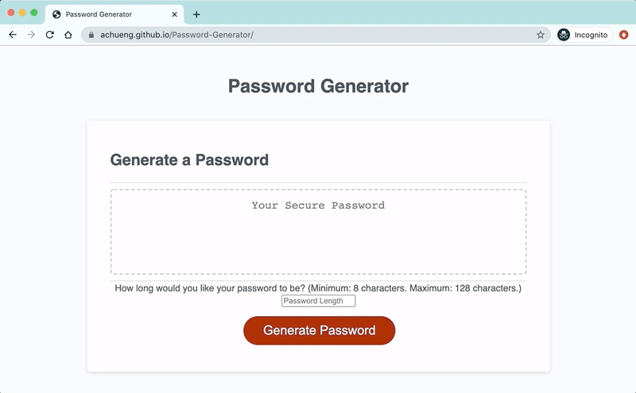

# Password-Generator

This project's objective is to build up a password generator using JavaScript.

**Deployed Link:** https://achueng.github.io/Password-Generator/

Working deployed website:

## Project Details

This project asks for a password generator that would take in the user's choices on which type of characters to include, as well as the password length. 
The user's choices are taken in through Javascript as values, which are then assigned to variables. These variables are utilized to come up with conditionals that would include/exclude a set of characters, and to determine how many random characters to generate. Generating a random character is done by: 

1. Putting the chosen sets of characters into an array
2. Looping over the array of sets of characters in a for loop
3. Using the Math.random() function to randomly generate a number between 0 and the array length
4. Taking the randomly generated number, and finding the element corresponding to that numbered index in the array
      
    (The element within the array is a set of characters set in another array)
5. Declaring what happens in #2-#4 as another variable
6. Repeating #2-#5 for the array consisting of a set of characters

After all of the above happens, the randomly generated character is added to a string that is assigned to a variable that stands to be the user's final password. As the parameters for the password length is set at a minimum of 8 characters and a maximum of 128 characters, the above steps happen at least 8 times and at most 128 times. This is achieveable through the use of Javascript. 

To optimize user experience and reduce confusion, while loops and if/else conditionals are utililzed to ensure that the user is directed to input their choices in the case that the required inputs are null. 